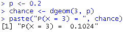

# P1_Probstat_B_5025201019

## Hans Sean Nathanael - 5025201019

### 1
a. 
adalah peluang X = 3 pada distribusi geometrik dengan p = 0,2 yang didapat dari fungsi dgeom(X, p)

b. 
rgeom() untuk menghasilkan 10000 data random distribusi geometrik dan kemudian dicari rata-rata berapa banyak data random yang digenerate bernilai 3

c. Berdasarkan hasil poin a dan b 

*hasil poin a*

*hasil poin b*
dapat diperhatikan bahwa hasil poin b lebih kecil dari pada hasil poin a tetapi mendekati hasil poin a dengan perbedaan 0.023

d. 
Histogram didapat dari random 10000 data poin b, didapatkan frekuensi X = 3 adalah 1001.

e. 
Rata-ratanya adalah menemui 4 orang yang tidak menghadiri acara vaksinasi sebelum keberhasilan pertama dan variansinya adalah 20
