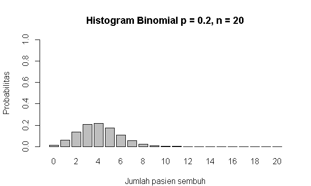

# P1_Probstat_B_5025201019

## Hans Sean Nathanael - 5025201019

### 1.
a. 

adalah peluang X = 3 pada distribusi geometrik dengan p = 0,2 yang didapat dari fungsi dgeom(X, p)

b. 

rgeom() untuk menghasilkan 10000 data random distribusi geometrik dan kemudian dicari rata-rata berapa banyak data random yang digenerate bernilai 3

c. 

Berdasarkan hasil poin a dan b 

*hasil poin a*

*hasil poin b*

dapat diperhatikan bahwa hasil poin b lebih kecil dari pada hasil poin a tetapi mendekati hasil poin a dengan perbedaan 0.023

d. 

Histogram didapat dari random 10000 data poin b, didapatkan frekuensi X = 3 adalah 1001.

e.

Rata-ratanya adalah menemui 4 orang yang tidak menghadiri acara vaksinasi sebelum keberhasilan pertama dan variansinya adalah 20

### 2.
a.

adalah peluang 4 pasien sembuh dari 20 pasien dengan p = 0,2. Fungsi dbinom() untuk mendapatkan nilai peluang.

b.

adalah histogram peluang jumlah pasien yang sembuh dengan grafik x adalah jumlah pasien sembuh dan y adalah peluangnya.

c.

rata-rata terdapat 4 pasien yang sembuh dengan variansi 3,2

### 3.
a.

adalah nilai peluang 6 bayi akan lahir di rumah sakit tersebut besok. Nilai didapatkan dari fungsi dpois()

b.

adalah total hari dalam 1 tahun di mana pada hari tersebut lahir 6 bayi, totalnya adalah 45 hari

c. 

dapat diperhatikan bahwa hasil poin b lebih kecil dari pada hasil poin a tetapi mendekati hasil poin a dengan perbedaan 0.048

d.

Nilai rata-rata telah diketahui dari soal yaitu 6 dan variansi Poisson sama dengan rata-ratanya. Rata-rata dan variansi tidak diambil dari hasil generate random karena tidak ada keterangan harus mengambil dari hasil generate.

### 4.
a.

PDF chi square

b.

histogram 100 data random chi square dengan degree of freedom = 10

c.

rata-rata sama dengan degree of freedom dan variansinya adalah 2 kali degree of freedom

